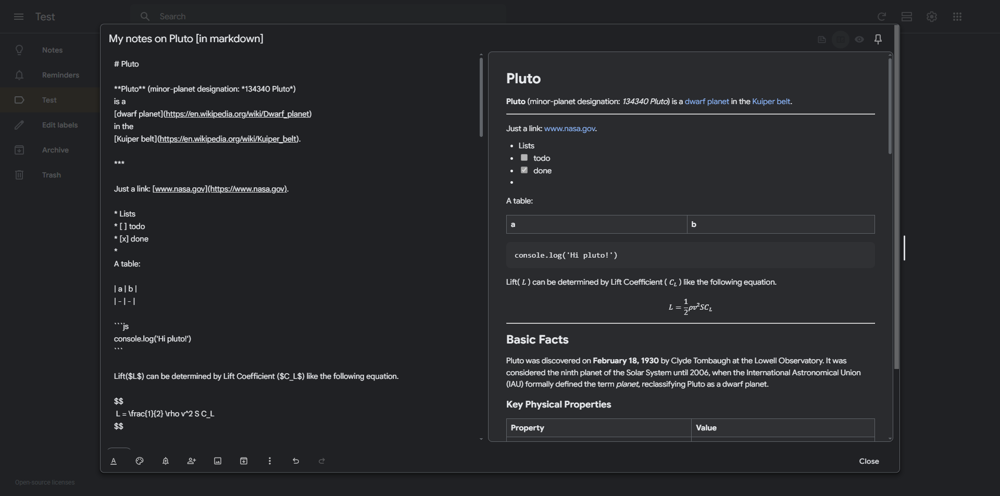

# KeepDown


A Chrome extension that adds real-time Markdown preview to Google Keep notes. Write your notes in Markdown and see them rendered instantly alongside your text.

## Features

- Real-time side-by-side Markdown preview
- Three Markdown view modes: **Editor** / **Editor and Preview** / **Preview**
- Built on top of [micromark](https://github.com/micromark/micromark)
    - 100% CommonMark compliant
    - GitHub Flavored Markdown supported
    - LaTeX math expressions supported
- Per-note view mode persistence — each note remembers its last selected mode
- Draggable resize handle with keyboard support for adjusting modal width on the fly
- Dark and Light preview themes



## Markdown View Modes

A three-button toggle is added next to Keep's "Pin note" button inside the modal:

- **Editor** — Default Google Keep editing view, no Markdown preview
- **Editor and Preview** — Side-by-side editor and rendered Markdown preview
- **Preview** — Rendered Markdown only, editor hidden

The active mode is saved per-note, so each note remembers its own view preference.

## Extension Settings

Click the extension icon to open the settings popup:

- **Markdown by default** — Toggle whether new notes open in Split mode or Editor mode
- **Preview theme** — Switch the Markdown preview between Dark and Light themes, with a live preview sample
- **Editor width** — Slider (50%–95%) to control modal width in Editor-only mode
- **Preview modes width** — Slider (50%–95%) to control modal width in Split / Preview modes
- **Reset** — Restore all settings to defaults

All changes sync instantly to any open Keep tab without reloading.


## Chrome Extension Permissions

This extension uses minimal permissions:

### Content Script Host Access
- The extension only runs on `https://keep.google.com/*` to:
  1. Add the Markdown preview panel to the note editor
  2. Listen for changes in the note content to update the preview
  3. Apply custom styling for the preview panel
  
  The extension does not:
  - Collect or transmit any note content
  - Access any Google account information
  - Modify or store your notes
  - Make any network requests
  
  All processing is done locally in your browser.

### storage Permission
- Used to save your preferences (like the note modal width setting) between browser sessions. This ensures your customized settings persist after closing and reopening your browser.

## Getting Started

1. Clone this repository
2. Install dependencies:

```bash
npm install
```

3. Build the extension:

```bash
npm run dev
```

4. Load the extension into Chrome:
   - Open Chrome and navigate to chrome://extensions/
   - Enable "Developer mode" in the top right
   - Click "Load unpacked"
   - Select the `extension` directory
   - Click "Add"

## Building for Production

```bash
npm run build
```

Create distribution ZIP (for Chrome Web Store):

```bash
zip -r dist-zip/keepdown.zip extension
```
